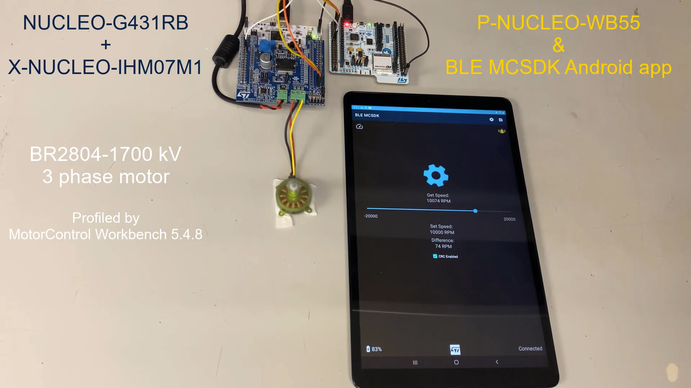
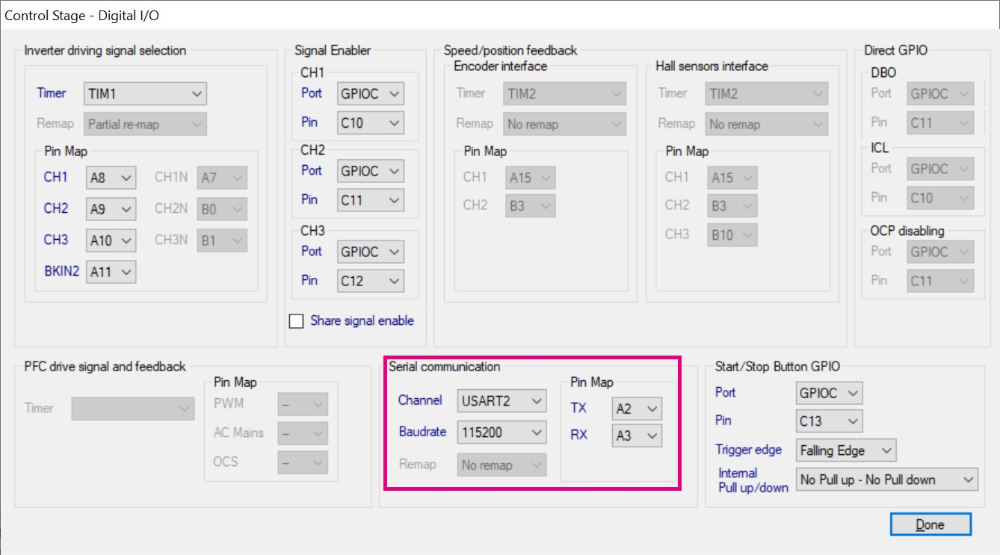
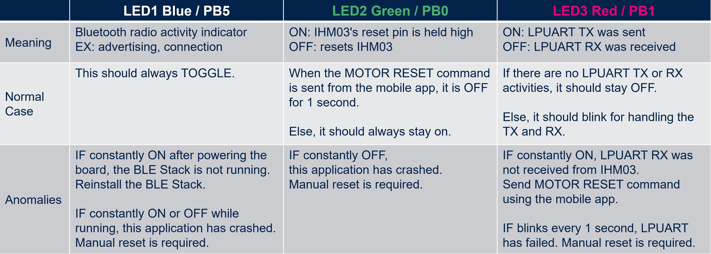

# STM32-Hotspot/STM32WB-BLE-Motor-Control-SDK MCU Firmware example

## Example

This Hotspot FW package includes:
   * A firmware application example called STM32WB-BLE-Motor-Control-SDK (*Motor Control Software Development Kit*).     
   * This example aims to demonstrate how to use the STM32WB55 microcontroller as a wireless remote control host using ST's legacy MCSDK shown in [user manual UM1052](https://www.st.com/resource/en/user_manual/um1052-stm32f-pmsm-singledual-foc-sdk-v43-stmicroelectronics.pdf).
   * The P-NUCLEO-WB55 board is running this STM32WB-BLE-Motor-Control-SDK application and the board is connected to a motor control board that uses the legacy X-CUBE-MCSDK v5.
   * For instance, like the picture shown above, a NUCLEO-G431RB used the MotorControl Workbench 5.4.8's motor profiling tool to spin the BR2804-1700 kV motor with the X-NUCLEO-IHM07M1.
   * This package **DOES NOT** include the STM32G4's firmware. Use the MotorControl Workbench tool to generate this.

## PC tools requirement
   * [MotorControl Workbench 5.4.8 in X-CUBE-MCSDK](https://www.st.com/en/embedded-software/x-cube-mcsdk.html)
   * [STM32CubeMX](https://www.st.com/en/development-tools/stm32cubemx.html) v6.5.0
   * [STM32CubeProg](https://www.st.com/en/development-tools/stm32cubeprog.html) v2.10.0
   * Supported IDE toolchains/compilers: IAR EWARM V9.20.x, [STM32CubeIDE](https://www.st.com/en/development-tools/stm32cubeide.html) v1.9.0

## Hardware Needed
* One [P-NUCLEO-WB55](https://www.st.com/en/evaluation-tools/p-nucleo-wb55.html)
* One motor control board such as [P-NUCLEO-IHM002 (NUCLEO-F302R8 with X-NUCLEO-IHM07M1)](https://www.st.com/en/evaluation-tools/p-nucleo-ihm002.html) or [P-NUCLEO-IHM03 (NUCLEO-G431RB with X-NUCLEO-IHM16M1)](https://www.st.com/en/evaluation-tools/p-nucleo-ihm03.html)

* Android Smartphone supporting Bluetooth LE 4.x

## Software Needed
* Android Smartphone app
   - Install the BLE MCSDK app on an Android smartphone by using the [APK](Utilities/Android/BLEMCSDK-v1.0.4.apk) file in *Media/Android/BLEMCSDK-v1.0.4.apk*.

## User's Guide
1. Motor board
   * Profile a motor using the MotorControl Workbench 5.4.8, check this [tutorial video](https://www.youtube.com/watch?v=h3ZuM2Z0UGs) to profile a motor with this tool.
   * In this case, a NUCLEO-G431RB was used to spin the BR2804-1700 kV motor with the X-NUCLEO-IHM07M1.
   * Check the USART/Serial communication pins. These pins have to be connected to the STM32WB55's LPUART pins.

2. P-NUCLEO-WB55 / STM32WB-BLE-MCSDK
   * This STM32WB55 firmware uses LPUART (PA2 and PA3) to send MCSDK commands to the motor board. Considering the motor board, 4 wires are required:
      - LPUART1 TX: Transmit MCSDK commands to the motor board
      - LPUART2 RX: Receive MCSDK command responses such as error codes from the motor board
      - PB0: This GPIO is connected to the GREEN LED of the P-NUCLEO-WB55 board. Connect this GPIO to the NUCLEO-G431RB's NRST pin to reset the STM32G4 if needed.
      - GND ground pin.
   * [Install ST's Bluetooth stack](https://youtu.be/wheGvdXsi4o), found under STM32CubeWB's *STM32WB_Copro_Wireless_Binaries\STM32WB5x*
   * Run or debug the STM32WB-BLE-MCSDK firmware on the P-NUCLEO-WB55 board by building it using the IDE toolchain
   * (OPTIONAL) Connect a serial terminal (Tera Term) to view the log messages.
   * **NOTE THAT** this example modified STM32WB's BLE_p2pServer example: *p2p_server_app.h/c*, *p2p_stm.h/c* and *hw_uart.c* has been modified. When using the STM32CubeMX for this project, revert these files after generating codes.
   * Check the P-NUCLEO-WB55's LEDs:

3. Android smartphone app
   * The STM32WB will be advertising as MCSDK. Connect this device using the BLE MCSDK mobile app.
   * After the connection is successful, start controlling the motor.

**Caution**
* When powering the motor, please verify that the electrical outlet on the dock is **wired correctly** to the motor shield board.
* Issues and the pull-requests are **not supported** to submit problems or suggestions related to the software delivered in this repository. This example is being delivered as-is, and not necessarily supported by ST. No major development activities are planned for this example. Check the RELEASE NOTE to see the known limitations.

**For any other question** related to the product, the hardware performance or characteristics, the tools, the environment, you can submit it to the **ST Community** on the STM32 MCUs related [page](https://community.st.com/s/topic/0TO0X000000BSqSWAW/stm32-mcus).
